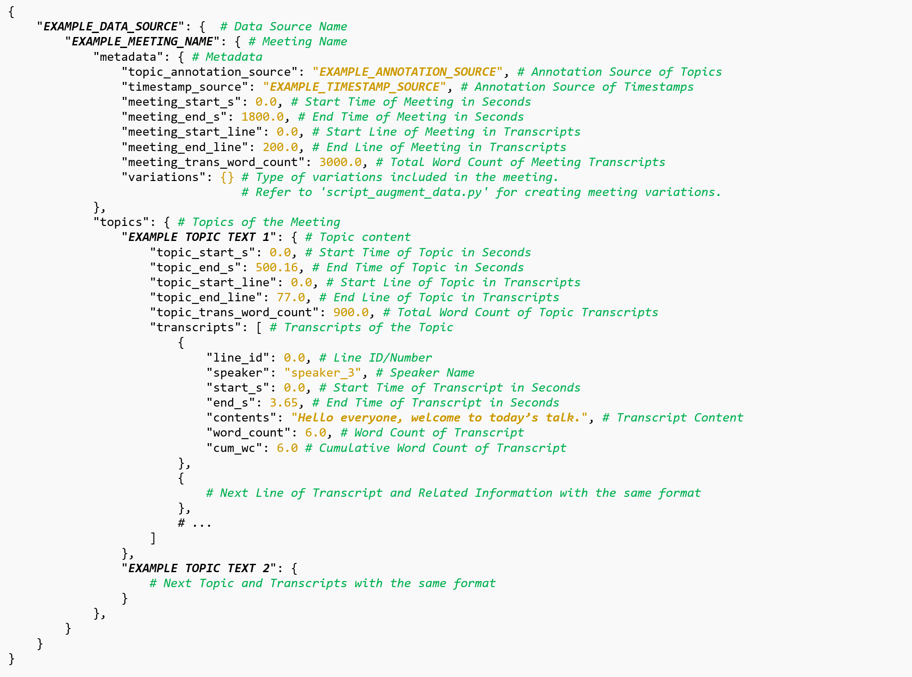

# Topic-Conversation Relevance (TCR) Dataset and Benchmarks
---
* TBD: Paper introduction

## Dataset Introduction
* Access: Data can be downloaded into the ```.\data``` folder [from here](https://mtmdata.blob.core.windows.net/data-share/topic_conversation.zip).
* TBD: Goal
* TBD: Different types, sources
* TBD: Number of meetings, number of topics, number of words

## Data Schema
* All data files are in JSON format. They can be downloaded from the link above.
* Data schema overview:

    

## Use Data

* The raw data can be downloaded from the link above and should be put under the ```.\data``` folder. They can be parsed based on the schema presentated above.

* Addtional scripts

    * Create synthetic ones from SIM data. [[script](script_create_synthetic_meetings_SIM.py)]
        * The ```SIM_syn100``` data created by this script is included in the ```.\data``` folder.
        * Run script (example):
        
            ```
            python script_create_synthetic_meetings_SIM.py --new_name syn100 --n_syn 100 --rdseed 2
            ```

    * Augment dataset by adding or removing topics. [[script](script_augment_data.py)]
        * The sample data created by this script is included in the ```.\data\example_aug``` folder.
        * Run script (example):

            ```
            python script_augment_data.py --input_data ICSI --new_name aug --variation_addTopics 0.3 --variation_removeTopics 0.3
            ```

## License
Refer to the [LICENSE](LICENSE) file for details.

## Contributing

This project welcomes contributions and suggestions. Most contributions require you to
agree to a Contributor License Agreement (CLA) declaring that you have the right to,
and actually do, grant us the rights to use your contribution. For details, visit
https://cla.microsoft.com.

When you submit a pull request, a CLA-bot will automatically determine whether you need
to provide a CLA and decorate the PR appropriately (e.g., label, comment). Simply follow the
instructions provided by the bot. You will only need to do this once across all repositories using our CLA.

This project has adopted the [Microsoft Open Source Code of Conduct](https://opensource.microsoft.com/codeofconduct/).
For more information see the [Code of Conduct FAQ](https://opensource.microsoft.com/codeofconduct/faq/)
or contact [opencode@microsoft.com](mailto:opencode@microsoft.com) with any additional questions or comments.

## Trademark Notice
Trademarks This project may contain trademarks or logos for projects, products, or services. Authorized use of Microsoft trademarks or logos is subject to and must follow [Microsoft’s Trademark & Brand Guidelines](https://www.microsoft.com/en-us/legal/intellectualproperty/trademarks/usage/general). Use of Microsoft trademarks or logos in modified versions of this project must not cause confusion or imply Microsoft sponsorship. Any use of third-party trademarks or logos are subject to those third-party’s policies.